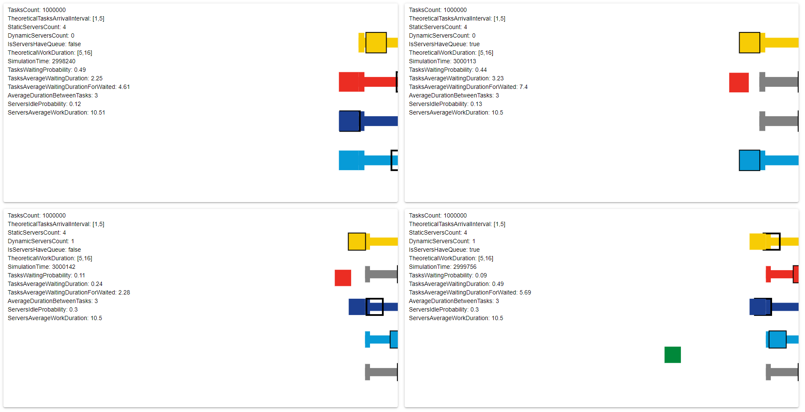

### Description

This is a graphical demonstration of examples from [queue theory](https://en.wikipedia.org/wiki/Queueing_theory). The main task was to implement visualization, the calculated statistics are not true due to the use of js timers.

### Demonstration

https://ingeniariussoftware.github.io/queue-visualization/

### Thanks

Special thanks for inspiration: https://dinopoloclub.com/games/mini-metro/

### Screenshot

